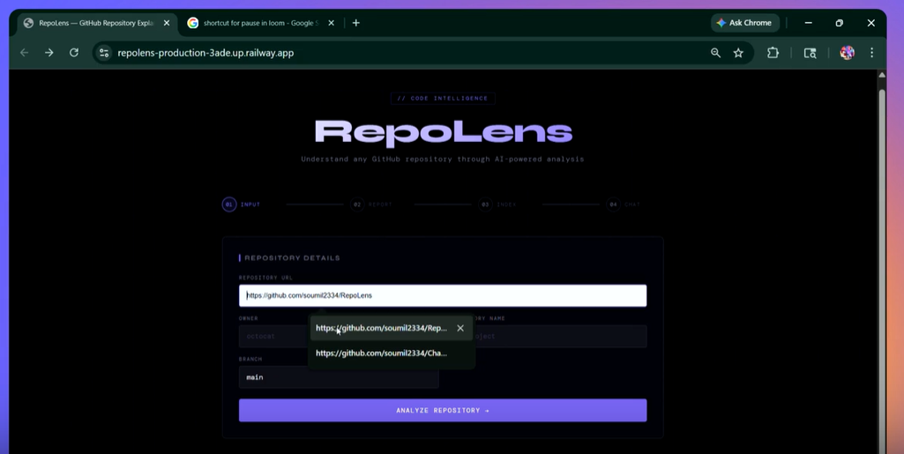

# RepoLens

> AI-powered GitHub repository explainer with Graph RAG chat

RepoLens analyzes any public GitHub repository and generates a structured technical tutorial. It then builds a knowledge graph from the codebase and lets you chat with it using a hybrid Graph RAG pipeline combining Neo4j, Qdrant, and the OpenAI Agents SDK.

---
## Demo

[](https://youtu.be/5dfbHOnt3Po)

---

## What It Does

1. **Analyzes** a GitHub repo by reading its files using the GitHub API
2. **Generates** a structured 2000+ word tutorial covering architecture, installation, key files, and code walkthrough — streamed live to the UI
3. **Exports** the tutorial as a styled PDF
4. **Indexes** the codebase into a knowledge graph (Neo4j) and vector database (Qdrant)
5. **Chats** with you about the codebase using a hybrid retrieval pipeline that combines vector search, graph descriptions, and graph traversal

---

## Architecture

```
User
 │
 ├── POST /analyze/{session_id}
 │     └── Parent Agent (OpenAI Agents SDK)
 │           ├── get_readme()          GitHub API
 │           ├── return_file_structure() GitHub API
 │           ├── Navigate_repo()       GitHub API
 │           └── create_chunks()       → Qdrant (raw code chunks)
 │
 ├── GET  /download/{session_id}
 │     └── pdfkit → PDF bytes → browser
 │
 └── WS   /chat/{session_id}
       ├── Create_KG()
       │     ├── scroll Qdrant (raw chunks)
       │     └── LLMGraphTransformer → GraphDocuments
       ├── Store_graph_Neo4j()   → Neo4j
       ├── Store_graph_Qdrant()  → Qdrant (graph doc embeddings)
       └── Chat loop
             └── Chat Agent (OpenAI Agents SDK)
                   └── Query_VectorDB()
                         ├── Qdrant vector search (graph docs)
                         └── Neo4j traversal (1-hop relationships)
```

---

## Tech Stack

| Component | Technology |
|---|---|
| Backend | FastAPI |
| Frontend | Vanilla HTML/CSS/JS |
| Parent Agent | OpenAI Agents SDK + GPT-4o |
| Chat Agent | OpenAI Agents SDK + GPT-4o-mini |
| Graph extraction | LangChain `LLMGraphTransformer` |
| Knowledge graph | Neo4j (Aura) |
| Vector database | Qdrant Cloud |
| Embeddings | OpenAI `text-embedding-3-small` |
| Code chunking | `tree-sitter` via `chunk_ast` |
| PDF generation | `pdfkit` + `wkhtmltopdf` |
| Tracing | OpenAI Agents SDK tracing |

---

## Prerequisites

- Python 3.11+
- [wkhtmltopdf](https://wkhtmltopdf.org/downloads.html) installed locally
- Neo4j Aura account (free tier works)
- Qdrant Cloud account (free tier works)
- OpenAI API key
- GitHub Personal Access Token

---

## Installation

```bash
git clone https://github.com/your-username/RepoLens.git
cd RepoLens
python -m venv myenv
source myenv/bin/activate  # Windows: myenv\Scripts\activate
pip install -r requirements.txt
```

---

## Environment Variables

Create a `.env` file in the project root:

```env
OPENAI_API_KEY=sk-...

# GitHub
Github_access_token=Bearer ghp_...

# Qdrant Cloud
QDRANT_CLUSTER=https://your-cluster.qdrant.io
QDRANT_API_KEY=your-qdrant-api-key

# Neo4j Aura
NEO4J_URI=neo4j+s://your-instance.databases.neo4j.io
NEO4J_USERNAME=neo4j
NEO4J_PASSWORD=your-neo4j-password
```

---

## Running the App

```bash
uvicorn main:app --reload
```

Open [http://localhost:8000](http://localhost:8000) in your browser.

---

## Usage

**Step 1 — Enter repository details**

Fill in the GitHub URL, owner, repository name, and branch. The owner and repo name auto-fill from the URL as you type.

**Step 2 — Analyze**

Click **Analyze Repository**. The parent agent reads the README, maps the file structure, navigates all core files, chunks them into Qdrant, and streams a full technical tutorial to the screen.

**Step 3 — Download PDF**

Click **Download PDF** to get a styled dark-theme PDF of the tutorial.

**Step 4 — Open Chat**

Click **Open Chat**. The app builds a knowledge graph from the Qdrant chunks, stores it in Neo4j, embeds the graph documents back into Qdrant, and opens a chat interface. The chat agent decides on every turn whether to query the vector database or answer from conversation history.

---

## Project Structure

```
RepoLens/
├── main.py                   # FastAPI app — routes and WebSocket
├── frontend.html             # Single-page UI
├── Parent_agent.py           # Parent agent — repo analysis pipeline
├── Function_tools.py         # Tools: get_readme, return_file_structure, Navigate_repo, create_chunks
├── save_as_pdf.py            # PDF generation (returns bytes)
├── Qdrant_db.py              # store_in_Qdrant helper
├── chunk_ast.py              # Tree-sitter based code chunking
│
├── Chat_logic/
│   ├── Chat.py               # Chat agent + get_answer generator
│   └── prompt.py             # CHAT_AGENT_INSTRUCTION
│
└── KG/
    ├── kg.py                 # Create_KG, Store_graph_Neo4j, Store_graph_Qdrant
    ├── Graph_RAG.py          # Graph_Query_Qdrant, traversal_query
    ├── graph_docs_Qdrant.py  # create_string_payload — graph doc stringifier
    └── create_prompt.py      # build_prompt — final LLM prompt builder
```

---

## How the Graph RAG Works

The chat uses a three-source hybrid retrieval pipeline:

**1. Vector search on graph documents (Qdrant)**
Each code chunk is processed by `LLMGraphTransformer` which extracts entities and relationships. The resulting `GraphDocument` is stringified into a text description and embedded. At query time, the most semantically similar graph docs are retrieved.

**2. Graph traversal (Neo4j)**
From the matched graph doc nodes, a 1-hop Cypher traversal finds directly connected entities — revealing how functions call each other, what they initialize, what they return. `MENTIONS` relationships are filtered out to reduce noise.

**3. Raw code chunks (Qdrant)**
The original code text is available in the graph doc payload and included as ground truth context.

All three sources are combined into a single prompt sent to the chat agent.

---

## Key Design Decisions

**Why Graph RAG over plain vector search?**
Vector search finds semantically similar chunks but misses structural relationships. A question like *"how does the upload endpoint connect to ChromaDB?"* requires following edges across files — which only graph traversal can do.

**Why stringify graph documents before embedding?**
Embedding models are trained on natural language. Converting `Node(id='Create_Db', type='Function')` to `"Function: Create_Db initializes Client"` produces richer embeddings that match developer questions more accurately.

**Why semaphore on LLM graph extraction?**
`LLMGraphTransformer` fires all documents concurrently by default. With large codebases this immediately exhausts the OpenAI TPM limit. A `Semaphore(3)` limits concurrent LLM calls to 3 at a time.

**Why session_id from the frontend?**
Using `crypto.randomUUID()` in the browser means no server round-trip is needed to start a session. The session_id ties the analysis (`/analyze/{id}`), download (`/download/{id}`), and chat (`/chat/{id}`) together without any persistent storage.

---

## Troubleshooting

**`wkhtmltopdf` not found**
Make sure it's installed and on your PATH. On Windows, update the path in `save_as_pdf.py`. On Linux/Mac, `brew install wkhtmltopdf` or `apt-get install wkhtmltopdf`.

**`Collection 'documents' doesn't exist`**
This happens when the chat is opened before the parent agent has finished analyzing the repo. Complete the analysis step first so `create_chunks` has populated Qdrant.

**Rate limit errors during graph extraction**
The semaphore limits concurrent calls but if your Qdrant collection has many chunks you may still hit TPM limits. Reduce the semaphore value to `asyncio.Semaphore(1)` or switch from `gpt-4o-mini` to a higher-tier model with more TPM.

**WebSocket disconnects immediately**
Make sure `await websocket.accept()` is the first line in the WebSocket handler — before any processing. The browser will time out if accept is delayed.

**Neo4j deprecation warnings flooding logs**
Add this near the top of `main.py`:
```python
import logging
logging.getLogger("neo4j.notifications").setLevel(logging.ERROR)
```

---

## License

MIT
